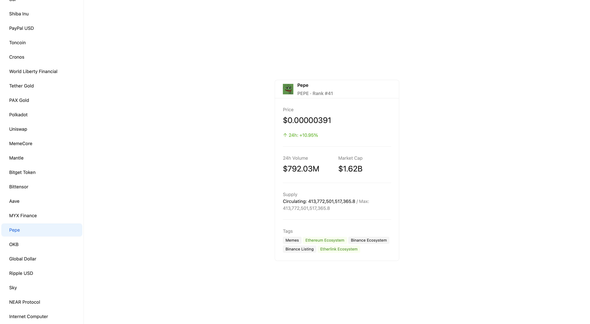

# 🪙 Crypto Base


A small full-stack (React + FastAPI) web application for exploring cryptocurrency data, powered by the [CoinMarketCap API](https://coinmarketcap.com/api/).

### Main page



---

## ✨ Features

- 📊 **Latest listings** — Fetch the latest cryptocurrency listings
- 🔍 **Currency details** — Get detailed quote data for any coin by ID
- ⚡ **Async FastAPI** — High-performance async HTTP with `aiohttp`
- 🔐 **Configurable** — API key and base URL via environment variables

---

## 🛠 Tech Stack

| Layer      | Tech                |
| ---------- | -------------------- |
| **Backend** | FastAPI, Pydantic Settings |
| **HTTP**   | aiohttp              |
| **Data**   | CoinMarketCap API    |
| **Frontend** | React, Vite, Ant Design |

---

## 📋 Prerequisites

- **Python 3.10+**
- **Node.js** (for the React frontend)
- **CoinMarketCap API key** — [Get one here](https://coinmarketcap.com/api/)

---

## 🚀 Quick Start

### 1️⃣ Clone & enter project

```bash
git clone <repo-url>
cd crypto_base
```

### 2️⃣ Create virtual environment

```bash
python -m venv venv
source venv/bin/activate   # macOS/Linux
# or: venv\Scripts\activate   # Windows
```

### 3️⃣ Install dependencies

```bash
pip install -r requirements.txt
```

### 4️⃣ Configure environment

Copy `.env.example` to `.env` and add your [CoinMarketCap API key](https://coinmarketcap.com/api/):

```bash
cp .env.example .env
# Edit .env and set CMC_API_KEY=your_key
```

Or create `.env` manually:

```env
CMC_API_KEY=your_coinmarketcap_api_key_here
CMC_BASE_URL=https://pro-api.coinmarketcap.com/v1
```

The server will start without a key, but CMC endpoints will fail until `CMC_API_KEY` is set.

### 5️⃣ Run the API

```bash
uvicorn backend.main:app --reload
```

The API will be available at **http://127.0.0.1:8000**.

### 6️⃣ Run the frontend (optional)

```bash
cd frontend
npm install
npm run dev
```

The app will be at **http://localhost:5173** (or the port Vite shows). Ensure the backend is running so the frontend can fetch cryptocurrency data.

---

## 📡 API Endpoints

| Method | Endpoint | Description |
|--------|----------|-------------|
| `GET` | `/cryptocurrencies` | Returns latest cryptocurrency listings |
| `GET` | `/cryptocurrencies/{currency_id}` | Returns quote data for a specific coin by ID |

### Examples

```bash
# Latest listings
curl http://127.0.0.1:8000/cryptocurrencies

# Bitcoin (id=1)
curl http://127.0.0.1:8000/cryptocurrencies/1
```


---

## 📜 License & Credits

Based on video tutorials — built for learning FastAPI and React. 🎓
